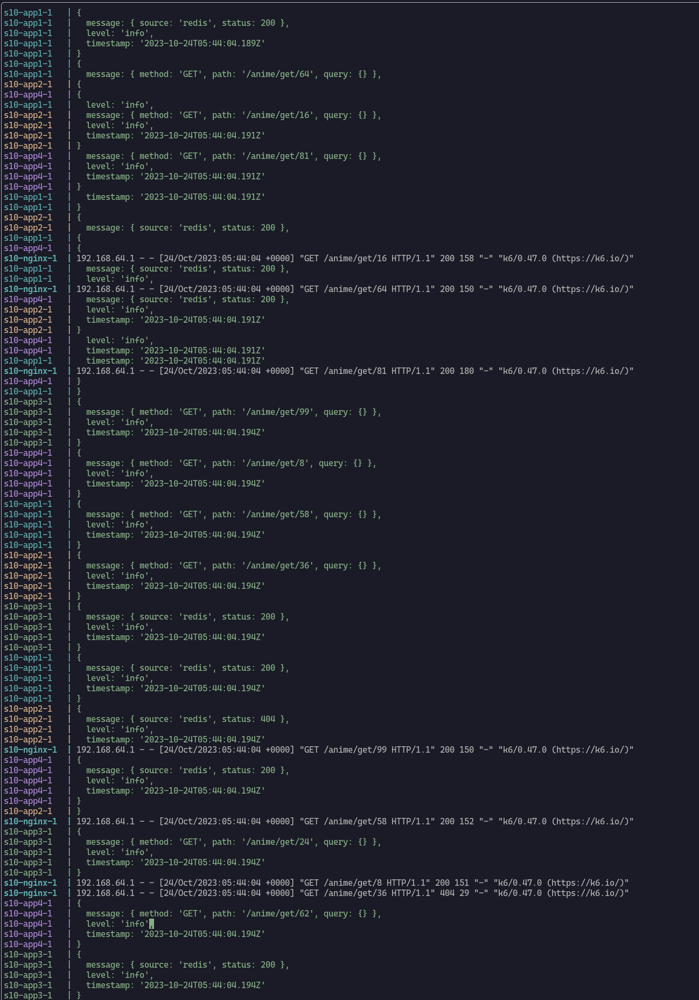

# software-2-typescript

## Archivos
- **cron-job.py:** cron-job para pasar data desde la API hacia la base de datos mongo.
- **nginx.conf**: archivo de configuración del load-balancer
- **k6.js:** archivo que contiene los test de estrés con 10000 request por 30 seg.
- **docker-compose.yml:** archivo para generar múltiples servidores, levantar bases de datos necesarios y ejecutar el load-balancer

## Evidencias

